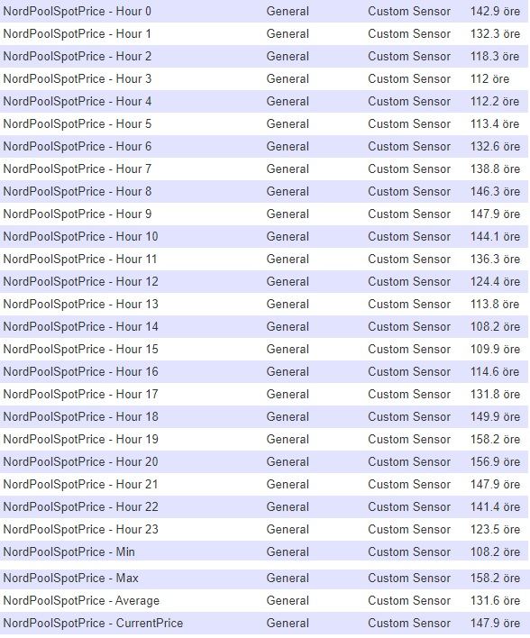

# NordPoolSpotPrice-Domoticz

It creates 28 devices, see picture.

You can select from different countries/areas and also choose to show in euro/kronor/kroner or cents/öre/øre

To download those files, go to domoticz/plugins and type:

sudo apt install git python-pip

sudo git clone https://github.com/flopp999/NordPoolSpotPrice-Domoticz.git

sudo pip install -r requirements.txt

